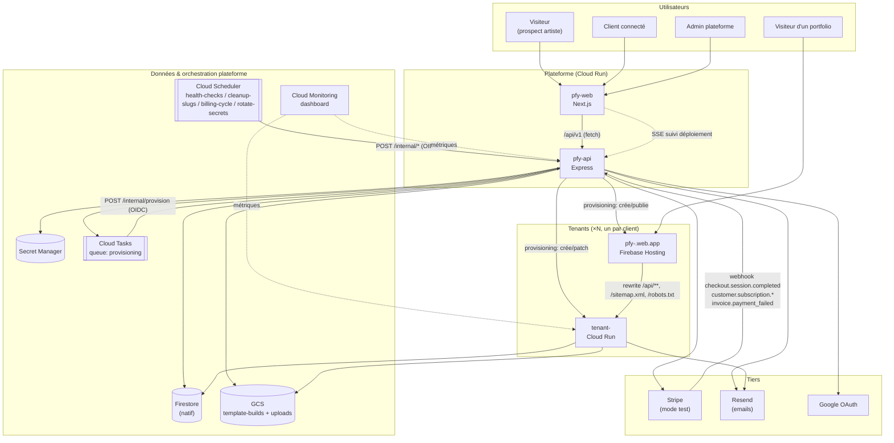
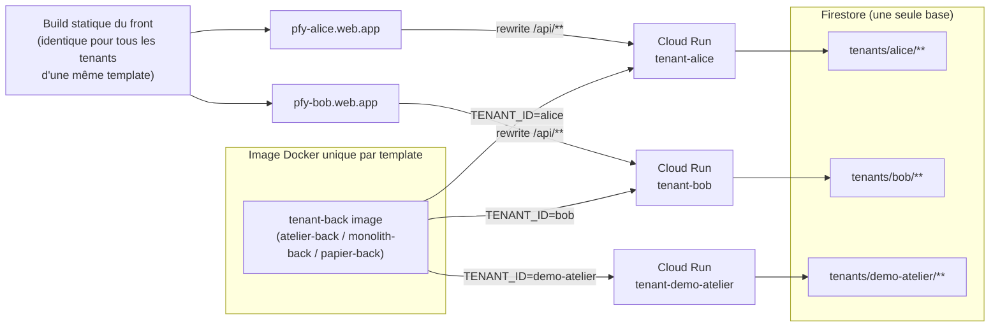
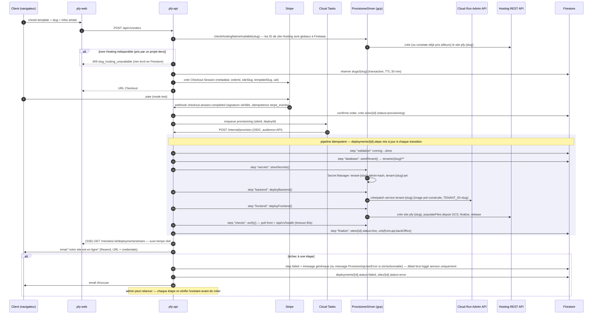
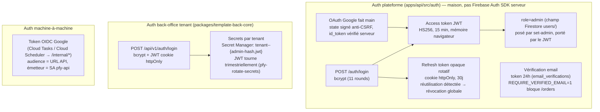

# Architecture — Port'ForYou

> Document de référence de l'architecture **telle qu'implémentée** dans ce repo (par opposition à `PortForYou.md`, qui est le cahier des charges prescriptif). En cas de divergence entre les deux, ce document doit être corrigé pour refléter le code — c'est le code qui fait foi.
>
> Voir aussi : `docs/RUNBOOK.md` (opérations), `docs/SECURITY.md` (contrôles de sécurité détaillés), `PortForYou.md` (spec complète, roadmap v2, estimation de coûts).

---

## 1. Vue d'ensemble

Port'ForYou est une plateforme SaaS : un artiste choisit une template de portfolio, paie un abonnement (Stripe, mode test), et un pipeline de provisioning automatique déploie son site (front + back + back-office) sur des ressources GCP dédiées, en quelques minutes.

**Composants principaux** :

| Composant                             | Rôle                                                                                                                                                              | Techno                        | Hébergement                                                   |
| ------------------------------------- | ----------------------------------------------------------------------------------------------------------------------------------------------------------------- | ----------------------------- | ------------------------------------------------------------- |
| `apps/web` (`pfy-web`)                | Vitrine publique + dashboards client/admin                                                                                                                        | Next.js App Router, TS strict | Cloud Run                                                     |
| `apps/api` (`pfy-api`)                | API plateforme (auth, commandes, paiement, provisioning, admin)                                                                                                   | Express 5 ESM, TS strict      | Cloud Run                                                     |
| `packages/template-back-core`         | Back Express commun aux 3 templates (routes, auth tenant, multi-tenant `TENANT_ID`)                                                                               | Express 5 ESM, TS strict      | packagé dans chaque image `tenant-<slug>`                     |
| `packages/template-front-core`        | Logique front commune aux 3 templates (pages, back-office, dialogs, router, seo) — seule la DA reste par template                                                 | JS (ESM/JSX)                  | bundlé par Vite dans le `dist/` statique de chaque front      |
| `templates/{atelier,monolith,papier}` | 3 templates de portfolio — back = wrapper fin sur `template-back-core`, front = `template-front-core` + 4 fichiers de DA (Artwork, ArtworkList, index.css, thème) | JS (ESM/JSX)                  | Cloud Run (`tenant-<slug>`) + Firebase Hosting (`pfy-<slug>`) |
| `packages/shared`                     | Schémas zod, constantes, types partagés (source de vérité via `z.infer`)                                                                                          | TS strict                     | importé par `api` et les templates                            |
| `infra/`                              | Scripts GCP idempotents (`setup-gcp.sh`, `setup-backups.sh`, `setup-uptime-checks.sh`), dashboard Cloud Monitoring, image Docker des émulateurs                   | bash, JSON                    | —                                                             |

---

## 2. Diagramme de contexte système



**Principe clé** : un seul projet GCP partagé (`portforyou-vsp`). Pas de projet par client — chaque tenant = 1 service Cloud Run + 1 site Firebase Hosting + un namespace Firestore (`tenants/{slug}/...`), le tout instancié depuis des artefacts **pré-construits par la CI** (aucun build au moment du provisioning).

---

## 3. Monorepo — structure du code

```
portforyou/
├── apps/
│   ├── web/                     Next.js — vitrine, dashboards client/admin
│   │   └── src/{app,components,lib}, middleware.ts (CSP)
│   └── api/                     Express — API plateforme
│       └── src/{routes,auth,orders,payments,provisioning,emails,middleware,lib}
├── packages/
│   ├── shared/                  zod schemas + constantes (platform, artwork, siteConfig, techniques)
│   ├── template-back-core/      Back Express commun aux 3 templates (TS strict)
│   └── template-front-core/     Logique front commune aux 3 templates (JSX) — DA injectée par template
├── templates/
│   ├── atelier/{back,front}      back = wrapper fin (package.json + src/index.js + seed.js)
│   ├── monolith/{back,front}     front = Vite/React, DA sombre/immersive
│   └── papier/{back,front}       front = Vite/React, DA claire/éditoriale
├── infra/
│   ├── scripts/setup-gcp.sh              Provisioning idempotent de l'infra GCP
│   ├── scripts/setup-backups.sh          Bucket + export Firestore hebdo (idempotent)
│   ├── scripts/setup-uptime-checks.sh    Uptime checks + alerte (idempotent)
│   ├── monitoring/dashboard.json         Dashboard Cloud Monitoring
│   ├── monitoring/alert-5xx.json         Policy d'alerte 5xx
│   ├── monitoring/alert-uptime.json      Policy d'alerte uptime checks
│   └── docker/emulators.Dockerfile
├── docs/                        RUNBOOK.md, SECURITY.md, ARCHITECTURE.md (ce document)
├── .github/workflows/           ci.yml, release-templates.yml, security.yml,
│                                 codeql.yml, dependency-review.yml, actionlint.yml,
│                                 lighthouse.yml
│                                 sonarcloud.yml, knip.yml, scorecard.yml, release-please.yml
├── docker-compose.yml           Dev local conteneurisé (alternative à `pnpm dev`)
├── firestore.rules / storage.rules / firestore.indexes.json
└── pnpm-workspace.yaml          apps/*, packages/*, templates/*/back, templates/*/front
```

Le pattern **driver** (interface + implémentation `fake` locale + implémentation réelle) structure les deux sous-systèmes les plus sensibles à l'environnement :

| Sous-système | Interface                                      | `fake` (local/CI)      | Réel                  |
| ------------ | ---------------------------------------------- | ---------------------- | --------------------- |
| Provisioning | `provisioning/driver.ts` (`ProvisionerDriver`) | `provisioning/fake.ts` | `provisioning/gcp.ts` |
| Paiement     | `payments/driver.ts` (`PaymentDriver`)         | `payments/fake.ts`     | `payments/stripe.ts`  |

---

## 4. Modèle multi-tenant



- **Une seule image Docker par template**, paramétrée par la variable d'env `TENANT_ID` : toutes les lectures/écritures Firestore du back sont préfixées `tenants/{TENANT_ID}/...` (voir `packages/template-back-core/src/lib/tenant.ts`), et les uploads Storage sous `tenants/{TENANT_ID}/uploads/...`. **Aucun rebuild par client.**
- **Un seul build statique par template** pour le front : il utilise des URLs relatives `/api/v1`, donc le même artefact sert tous les tenants — c'est le rewrite Firebase Hosting (`/api/** → service Cloud Run du tenant`) qui route chaque site vers son propre back.
- **SEO par-tenant servi par le back** : le HTML statique du front étant partagé, `/sitemap.xml` et `/robots.txt` sont générés dynamiquement par le back du tenant (depuis ses œuvres et son `site_config`). Le provisioning ajoute donc deux rewrites Hosting supplémentaires (`/sitemap.xml → Cloud Run` et `/robots.txt → Cloud Run`), placés **avant** le catch-all SPA `** → /index.html` (sinon Hosting servirait `index.html`). Les balises `<head>` par-page (title, description, Open Graph, JSON-LD) sont, elles, injectées au runtime côté front une fois `site_config` chargé (`templates/*/front/src/seo.js`).
- **Instance démo** (`demo-atelier`, `demo-monolith`, `demo-papier`) : même mécanisme, avec `DEMO_MODE=1` qui fait renvoyer 403 à toute mutation du back-office (lecture seule pour les prospects).

---

## 5. Infrastructure GCP

### 5.1 Diagramme des ressources (projet unique `portforyou-vsp`, région `europe-west1`)

```mermaid
graph TB
    subgraph "Compute"
        RunApi["Cloud Run: pfy-api"]
        RunWeb["Cloud Run: pfy-web"]
        RunTenants["Cloud Run: tenant-<slug> ×N"]
    end
    subgraph "Hosting"
        HostMain["Firebase Hosting: portforyou\n(alias vitrine)"]
        HostTenants["Firebase Hosting: pfy-<slug> ×N"]
    end
    subgraph "Données"
        Firestore[("Firestore native\nune base, deux domaines:\nplateforme + tenants/**\nPITR 7 jours")]
        GCSBuilds[("GCS: portforyou-template-builds")]
        GCSUploads[("GCS: portforyou-uploads\n(lecture publique sur tenants/*/uploads)")]
        GCSBackups[("GCS: portforyou-firestore-backups\n(exports hebdo, purge > 180j)")]
    end
    subgraph "Orchestration"
        Registry["Artifact Registry: pfy\n(images api, web, {template}-back)\ncleanup policy: 10 versions, purge > 90j"]
        Queue[["Cloud Tasks: provisioning\n(5 tentatives, backoff 30–300s)"]]
        SchedHealth["Cloud Scheduler: pfy-health-checks (*/10 min)"]
        SchedCleanup["Cloud Scheduler: pfy-cleanup-slugs (horaire)"]
        SchedBilling["Cloud Scheduler: pfy-billing-cycle (1er du mois 03h Paris)"]
        SchedRotate["Cloud Scheduler: pfy-rotate-secrets (trimestriel)"]
        SchedExport["Cloud Scheduler: pfy-firestore-export (hebdo, dim. 03h Paris)"]
    end
    subgraph "Secrets & identité"
        SM["Secret Manager\npfy-jwt-secret, pfy-stripe-secret,\npfy-stripe-webhook, pfy-google-oauth-secret,\npfy-resend-key, tenant-<slug>-admin-hash,\ntenant-<slug>-jwt"]
        Auth["Firebase Auth\n(compte email/pass — auth réelle maison, pas le SDK serveur)"]
        WIF["Workload Identity Federation\n(GitHub Actions → pfy-ci, zéro clé JSON)"]
    end
    subgraph "Observabilité & coûts"
        MonDash["Cloud Monitoring\ndashboard (infra/monitoring/dashboard.json)"]
        MonAlert["Cloud Monitoring\nalerte 5xx (infra/monitoring/alert-5xx.json)\n→ canal email"]
        MonUptime["Cloud Monitoring\n4 uptime checks + alerte\n(infra/monitoring/alert-uptime.json)\n→ même canal email"]
        Budget["Budget + alertes 50/90/100 %"]
    end

    RunApi --> Firestore
    RunApi --> SM
    RunApi --> Queue
    RunApi --> GCSBuilds
    RunApi --> GCSUploads
    RunApi -->|Cloud Run Admin API| RunTenants
    RunApi -->|Hosting REST API| HostTenants
    RunTenants --> Firestore
    RunTenants --> GCSUploads
    Registry --> RunApi
    Registry --> RunWeb
    Registry --> RunTenants
    SchedExport -->|"POST :exportDocuments (OAuth SA pfy-api)"| Firestore
    SchedExport --> GCSBackups
    MonUptime -.->|ping /api/v1/health| RunApi
    MonUptime -.->|ping /api/v1/health| HostTenants
```



### 5.2 Inventaire des ressources

| Ressource          | Nom                                                                                 | Créée par                                                                                                 |
| ------------------ | ----------------------------------------------------------------------------------- | --------------------------------------------------------------------------------------------------------- |
| Cloud Run          | `pfy-api`, `pfy-web`                                                                | CI (`ci.yml` job `deploy`, `gcloud run deploy`)                                                           |
| Cloud Run          | `tenant-<slug>` (×N)                                                                | provisioning (`gcp.ts` → Cloud Run Admin API)                                                             |
| Firebase Hosting   | `portforyou` (vitrine)                                                              | `firebase.json` racine                                                                                    |
| Firebase Hosting   | `pfy-<slug>` (×N)                                                                   | provisioning (`gcp.ts` → Hosting REST API)                                                                |
| Firestore (native) | base par défaut, PITR 7 jours                                                       | `setup-gcp.sh`                                                                                            |
| Cloud Storage      | `portforyou-template-builds`, `portforyou-uploads`                                  | `setup-gcp.sh`                                                                                            |
| Cloud Storage      | `portforyou-firestore-backups` (exports hebdo, lifecycle > 180j)                    | `setup-backups.sh`                                                                                        |
| Artifact Registry  | `pfy` (docker), cleanup policy (garde 10 versions, purge > 90j)                     | `setup-gcp.sh`                                                                                            |
| Cloud Tasks        | queue `provisioning`                                                                | `setup-gcp.sh`                                                                                            |
| Cloud Scheduler    | `pfy-health-checks`, `pfy-cleanup-slugs`, `pfy-billing-cycle`, `pfy-rotate-secrets` | `setup-gcp.sh` (après 1er déploiement de `pfy-api`)                                                       |
| Cloud Scheduler    | `pfy-firestore-export` (hebdo, dim. 03h Paris)                                      | `setup-backups.sh`                                                                                        |
| Secret Manager     | secrets plateforme + `tenant-<slug>-{admin-hash,jwt}`                               | `setup-gcp.sh` (placeholders) + provisioning (secrets tenant)                                             |
| Cloud Monitoring   | dashboard « Vue d'ensemble plateforme & tenants »                                   | `setup-gcp.sh` / `infra/monitoring/dashboard.json`                                                        |
| Cloud Monitoring   | policy d'alerte « Erreurs 5xx — plateforme & tenants » + canal email                | `setup-gcp.sh` / `infra/monitoring/alert-5xx.json` (composant `gcloud alpha`)                             |
| Cloud Monitoring   | 4 uptime checks (`pfy-api`, 3 tenants démo) + policy d'alerte, même canal email     | `setup-uptime-checks.sh` / `infra/monitoring/alert-uptime.json` (composants `gcloud beta`+`gcloud alpha`) |
| Budget             | `portforyou-budget` (20 € par défaut, `MONTHLY_BUDGET_EUR`, seuils 50/90/100 %)     | `setup-gcp.sh` (si `BILLING_ACCOUNT_ID` fourni)                                                           |

### 5.3 IAM — service accounts (moindre privilège)

| Service account | Usage                                                          | Rôles clés                                                                                                                                                                |
| --------------- | -------------------------------------------------------------- | ------------------------------------------------------------------------------------------------------------------------------------------------------------------------- |
| `pfy-api`       | Runtime de `pfy-api` ; exécute le provisioning                 | `datastore.user`, `run.admin`, `firebasehosting.admin`, `secretmanager.admin`, `cloudtasks.enqueuer`, `storage.objectAdmin`, `artifactregistry.reader` (images templates) |
| `pfy-tenant`    | Runtime des services `tenant-<slug>`                           | `datastore.user`, `storage.objectAdmin` (bucket uploads) — accès aux secrets accordé secret par secret par le provisioner                                                 |
| `pfy-ci`        | CI GitHub Actions (déploiement plateforme uniquement, via WIF) | `artifactregistry.writer`, `run.developer`, `storage.objectAdmin`, `datastore.user`, `firebasehosting.admin`                                                              |

**Aucune clé de service account exportée** : la CI s'authentifie via Workload Identity Federation (`google-github-actions/auth`), scoping strict au repo GitHub (`assertion.repository == 'cenacrew/PortForYou'`).

---

## 6. Pipeline de provisioning (le cœur du système)



**Étapes** (`packages/shared` → `DEPLOYMENT_STEP_IDS`) : `validation` → `database` → `secrets` → `backend` → `frontend` → `checks` → `finalize`. Implémentation : `apps/api/src/provisioning/pipeline.ts` (`runProvisioning`).

**Disponibilité du nom Hosting vérifiée avant paiement** : les ID de site Firebase Hosting (`pfy-<slug>`) sont uniques sur **tout Firebase**, pas seulement le projet `portforyou-vsp` — un slug jamais utilisé côté PortForYou peut donc être déjà pris par un projet tiers, sans qu'aucune vérification interne ne puisse le détecter. Sans garde-fou, la commande serait payée puis le provisioning échouerait irrémédiablement à l'étape `frontend`, avec un message générique ne donnant aucune piste (bug rencontré en prod sur le tenant `test2` : `pfy-test2` réservé par un projet Firebase tiers, échec identique à chaque relance). `reserveSlug` (`apps/api/src/orders/service.ts`) appelle donc `driver.checkHostingNameAvailable(slug)` **avant** la transaction Firestore (après un simple rejet rapide si le slug est déjà pris côté PortForYou) : en cas d'indisponibilité, rien n'a encore été écrit dans Firestore et `POST /orders` répond directement `409 slug_hosting_unavailable` — avant tout paiement, sans réservation à annuler. Cet ordre élimine aussi toute fenêtre où une réservation serait visible à d'autres utilisateurs avant d'être annulée. Effet de bord accepté : la vérification crée réellement le site Hosting (vide, sans release) si le nom est libre, ce qui le réserve globalement dès cet instant ; l'étape `frontend` du pipeline le retrouvera ensuite via le même appel idempotent (409 toléré). Si l'utilisateur abandonne avant paiement, ce site Hosting vide reste orphelin le temps du TTL — nettoyage automatique ci-dessous.

**Nettoyage des sites Hosting orphelins** : `POST /internal/cleanup-slugs` (Cloud Scheduler, horaire — voir §8) purge les réservations `slugs/{slug}` expirées (TTL 30 min, jamais payées). Avant de libérer chaque slug, il appelle désormais `driver.deprovision(slug)` pour supprimer le site Hosting orphelin créé par `checkHostingNameAvailable` — idempotent et sans effet pour les autres ressources (aucune n'a été créée pour une simple réservation jamais confirmée, `deprovision` tolère leur absence). Si `deprovision` échoue pour un slug donné, la réservation Firestore n'est pas supprimée : elle reste éligible à la purge (et donc au nouvel essai de `deprovision`) au prochain passage horaire, sans bloquer le nettoyage des autres slugs expirés.

**Erreurs de provisioning sûres à afficher** : la plupart des erreurs du pipeline restent génériques côté client (`pipeline.ts`, voir plus bas) pour ne jamais faire fuiter un détail d'API GCP. Exception : `ProvisioningUserError` (`apps/api/src/provisioning/errors.ts`), levée par `gcp.ts` pour les cas identifiés comme sûrs et actionnables (ex. nom de site Hosting déjà pris ailleurs) — son message est alors affiché tel quel dans `deployments/{id}.steps[].error`.

**Deux modes de déclenchement** (`dispatchProvisioning`) :

- **Local/CI** (`PROVISIONING_VIA_TASKS=0`) : exécution directe en tâche de fond dans le process `pfy-api`.
- **Prod** (`PROVISIONING_VIA_TASKS=1`) : passe par Cloud Tasks (retries automatiques, `POST /internal/provision` protégé par vérification du token OIDC — seul le SA de Cloud Tasks peut l'appeler).

**Suivi temps réel** : contrairement à une architecture `onSnapshot` client-side, le dashboard consomme un flux **SSE servi par l'API** (`GET /me/sites/:id/deployments/stream`, auth par token en query via `requireAuthSse`) — cohérent avec les règles Firestore deny-all (`firestore.rules`) : le navigateur ne parle jamais directement à Firestore.

**Idempotence sous contention réelle** : `confirmPaidOrder` (`apps/api/src/orders/service.ts`, appelé par le webhook Stripe et par `/payments/fake/confirm`) fait son read-check-create dans une **transaction Firestore** — un rejeu concurrent du webhook (ce que Stripe fait parfois en cas de timeout réseau) ne crée jamais deux sites pour la même commande. Validé par test d'exploitation réel (10 requêtes concurrentes sur le même slug, confirmation concurrente d'une même commande) dans `apps/api/src/__tests__/pentest.provisioning.int.test.ts` — voir `docs/SECURITY.md` pour le détail de la faille trouvée et corrigée.

---

## 7. Modèle de données Firestore

### 7.1 Domaine plateforme

| Collection                                                          | Contenu                                                                                                     | Accès                      |
| ------------------------------------------------------------------- | ----------------------------------------------------------------------------------------------------------- | -------------------------- |
| `users/{uid}`                                                       | Profil (displayName, email, stripeCustomerId, role, createdAt)                                              | API uniquement (Admin SDK) |
| `orders/{orderId}`                                                  | uid, templateSlug, siteSlug, stripeSessionId, status, montants                                              | idem                       |
| `sites/{siteId}`                                                    | uid, slug, templateSlug, status (`provisioning\|live\|error\|suspended`), urls, stripeSubscriptionId        | idem                       |
| `deployments/{deployId}`                                            | siteId, trigger, status, `steps[]` (id, label, status, startedAt, finishedAt, error?)                       | idem                       |
| `slugs/{slug}`                                                      | réservation atomique (transaction), TTL 30 min                                                              | idem                       |
| `stripe_events/{eventId}`                                           | idempotence des webhooks                                                                                    | idem                       |
| `templates/{slug}`                                                  | `currentVersion` (poussé par `release-templates.yml`)                                                       | idem                       |
| `stripe_events`, `email_logs`, `contact_requests`                   | Journalisation (webhooks, emails envoyés, formulaire vitrine)                                               | idem                       |
| `sessions`, `user_emails`, `password_resets`, `email_verifications` | Auth maison : refresh tokens (hash), pointeur email→uid, tokens de reset/vérification à usage unique (hash) | idem                       |

TTL Firestore natif sur le champ `expiresAt` de `sessions`, `password_resets` et
`email_verifications` (`setup-gcp.sh`) : les documents expirés sont purgés automatiquement,
sans job de nettoyage applicatif.

### 7.2 Domaine tenant (`tenants/{slug}/...`)

| Sous-collection / doc          | Contenu                                                                                                                               |
| ------------------------------ | ------------------------------------------------------------------------------------------------------------------------------------- |
| `artworks/{id}`                | title, technique (6 valeurs, `packages/shared/techniques.ts`), height, width, support?, year?, comment?, imageUrl, additionalImages[] |
| `site_config/main`             | heroImageUrl, techniqueImages, biographyText/Image, pressItems[], newsItems[], contactEmail, réseaux                                  |
| `analytics_daily/{yyyy-mm-dd}` | pageViews, visitors (hashes journaliers), paths{}, artworkViews{}                                                                     |
| `contact_messages/{id}`        | Messages du formulaire de contact public du tenant                                                                                    |

Index composite requis (`firestore.indexes.json`) : `artworks(technique ASC, createdAt DESC)`, plus les index `deployments(siteId, createdAt)` et `sites(uid, createdAt)` déclarés au niveau plateforme.

**Règles Firestore** (`firestore.rules`) : deny-all intégral — tous les accès passent par l'Admin SDK côté serveur (API plateforme ou back tenant), jamais par le SDK client.

---

## 8. Authentification



- **Plateforme** : `requireAuth` (Bearer JWT), `requireAdmin` (rôle Firestore), `requireAuthSse` (token en query pour EventSource, seule variante côté API à accepter un token hors header `Authorization`).
- **Ownership** : toute route `/me/sites/:id` vérifie `site.uid === token.uid` (voir `apps/api/src/routes/me.ts`) — validé par test d'exploitation réel (IDOR) sur les 5 sous-routes (`pentest.provisioning.int.test.ts`).
- **RGPD** (`me.ts`) : `GET /me/account/export` (portabilité, art. 20) renvoie en JSON téléchargeable le profil + les sites + les commandes du seul user authentifié (filtrés par `uid`, sans hash de mot de passe ni secret — test d'ownership `me.export.test.ts`) ; `DELETE /me/account` (droit à l'effacement) anonymise le profil, révoque les sessions et suspend les sites. Côté vitrine : pages publiques `/mentions-legales` et `/confidentialite`, registre des traitements `docs/rgpd/registre-traitements.md`.
- **Vérification d'email** : token à usage unique 24h (`createEmailVerification`/`consumeEmailVerification`, `auth/service.ts`), envoyé à l'inscription et sur demande (`POST /auth/resend-verification`, authentifié). `REQUIRE_VERIFIED_EMAIL=1` en prod bloque `POST /orders` tant que non confirmé ; comptes Google vérifiés d'office.
- **Tenant** : modèle repris tel quel de `marcel-nino-pajot` — un seul compte admin par tenant, email + hash bcrypt injectés en variables d'env (via Secret Manager en prod). Le `JWT_SECRET` (session back-office uniquement) tourne automatiquement tous les trimestres ; le mot de passe admin ne tourne jamais automatiquement (régénération manuelle uniquement, pour ne jamais couper l'accès de l'artiste sans le prévenir).
- **`/internal/*`** (`internal.ts`) : `requireCloudTasksOidc` — seul un token OIDC signé par le SA `pfy-api` avec la bonne audience passe ; validé par test d'exploitation réel (sans token, avec un Bearer forgé) sur les 5 endpoints internes.
- **Contrat d'API documenté** : `GET /api/v1/docs` (`routes/docs.ts`, public, non authentifié) sert une spécification **OpenAPI 3.0** générée à la volée (`openapi/document.ts`, via `@asteasolutions/zod-to-openapi`) à partir des schémas zod de `packages/shared` — la doc dérive du code, sans duplication. La surface machine-à-machine `/internal/*` n'y est jamais enregistrée (aucune route interne ni secret exposé) ; couvert par `__tests__/docs.test.ts`. Pas d'UI Swagger embarquée (aucune dépendance lourde ni CDN externe, politique CSP `helmet`) — brancher au besoin une UI locale sur cette URL (ex. `npx @redocly/cli preview-docs`).

---

## 9. Paiement (Stripe, mode test uniquement)

- Bootstrap idempotent (`pnpm stripe-setup`) : produit + meter `pfy_infra` + 3 prix (base fixe, domaine, infra à l'usage).
- `POST /api/v1/orders` (`orders.ts`) : réserve le slug, crée/récupère le `stripeCustomerId`, crée la Checkout Session (`payments/stripe.ts` derrière l'interface `PaymentDriver`).
- **Webhook** (`POST /api/v1/stripe/webhook`, `payments.ts`) : monté **avant** `express.json()` dans `app.ts` pour recevoir le raw body (vérification de signature), idempotence via `stripe_events`.
  - `checkout.session.completed` → confirme l'order, crée `sites/{id}`, déclenche le provisioning.
  - `customer.subscription.updated|deleted` → sync du statut d'abonnement.
  - `invoice.payment_failed` → email + flag.
- **Mode `fake`** local : `POST /api/v1/payments/fake/confirm` (`payments.ts`) permet de simuler un paiement réussi sans Stripe, protégé par `requireAuth` (le client ne confirme que sa propre commande) — utilisé par la page `/order/fake-checkout` de la vitrine.
- **Cycle mensuel** : `pfy-billing-cycle` (Cloud Scheduler) → `POST /internal/billing-cycle` — estime la conso (Cloud Monitoring + Storage), pousse l'usage sur le meter Stripe.

---

## 10. CI/CD

```mermaid
graph TB
    PR["Pull Request"] --> Changes["changes\ndorny/paths-filter — templates/** ou\npackages/template-{back,front}-core/** ?"]
    PR --> Lint["lint\neslint + prettier --check"]
    PR --> Test["test\nAPI (vitest+supertest) + web (vitest+RTL)\n+ test:emu (émulateur Firestore)"]
    PR --> E2E["e2e\nPlaywright — flow démo complet\n(émulateurs + api + web + driver fake)"]
    Changes -->|templates == true| TBack["templates-back\ntemplate-back-core + template-front-core (une fois)"]
    Changes -->|templates == true| TFront["templates-front\nmatrice atelier / monolith / papier"]
    Changes -->|templates == false| Skip["skipped\n(traité comme réussi par les required checks)"]

    Lint --> Deploy
    Test --> Deploy
    Push["Push main\n(hors PR, sans [skip deploy])"] --> Deploy["deploy\nbuild+push images api/web (Artifact Registry)\nscan Trivy (CRITICAL,HIGH)\ngcloud run deploy pfy-api, pfy-web\npurge cache Hosting vitrine\nsmoke test /api/v1/health + home vitrine"]

    TemplChange["Push templates/**\n(ou déclenchement manuel)"] --> Release["release-templates.yml\npour chaque template modifiée :\nbuild+push image back (atelier-v<N>)\nscan Trivy (CRITICAL,HIGH)\nbuild front Vite → upload GCS\nMAJ templates/{slug}.currentVersion (Firestore)"]

    Cron["Cron — lundi 06h UTC"] --> Security["security.yml\npnpm audit --audit-level high"]
    Cron2["Cron — lundi 07h UTC"] --> CodeQL["codeql.yml\nSAST javascript-typescript"]
    Cron3["Cron — lundi 08h UTC"] --> Scorecard["scorecard.yml\nOSSF Scorecard, SARIF"]
    PR --> DepReview["dependency-review.yml\nnouvelles dépendances de la PR, fail-on high+"]
    PR --> Sonar["sonarcloud.yml\nquality gate + couverture lcov (api, template-back-core)"]
    PR --> Knip["knip.yml\ncode mort — informatif, continue-on-error"]
    WFChange["Push/PR sur .github/workflows/**"] --> Actionlint["actionlint.yml\nlint des workflows (+ shellcheck)"]
    WebChange["Push/PR sur apps/web/**"] --> Lighthouse["lighthouse.yml\nbuild+serve vitrine, audit home +\n/templates/atelier (perf/a11y/SEO/bonnes pratiques)"]
    Push --> ReleasePlease["release-please.yml\nPR de release (CHANGELOG + version) à jour"]
```



- **`ci.yml`** : pipeline unique validation → déploiement. Auth CI via **Workload Identity Federation** (aucune clé JSON). Le déploiement est sérialisé (`concurrency: deploy-platform, cancel-in-progress: false`) pour ne jamais interrompre une release en cours. Les jobs `templates-back`/`templates-front` sont conditionnés au job de filtre `changes` (`dorny/paths-filter`, pattern `needs`+`if`) : ils ne tournent que si `templates/**`, `packages/template-back-core/**` ou `packages/template-front-core/**` a changé — sinon ils passent en statut `skipped`, traité comme réussi par les required checks de branch protection. Le job `deploy` scanne les images `api`/`web` avec Trivy (`CRITICAL,HIGH`, `exit-code: 1`) juste après le build/push et avant le `gcloud run deploy` correspondant, puis termine par un smoke test (`curl --fail` avec retries) sur `/api/v1/health` de l'API et la home de la vitrine.
- **`release-templates.yml`** : matrice `[atelier, monolith, papier]`, déclenché par un changement dans `templates/**` sur `main` ou manuellement (choix de la template ou `all`). Chaque image back est scannée par Trivy (`CRITICAL,HIGH`) avant le build du front et la mise à jour Firestore. Les tenants existants restent sur leur version tant qu'un redeploy admin n'est pas demandé.
- **`security.yml`** : `pnpm audit` sorti du pipeline bloquant (hebdomadaire + manuel) pour ne pas casser une PR au hasard sur un nouvel avis de sécurité.
- **`codeql.yml`** : analyse statique de sécurité (SAST) `javascript-typescript` via `github/codeql-action`, sur PR vers `main`, push `main` et cron hebdomadaire (lundi 07h UTC). Nécessite que le code scanning soit activé côté GitHub (Settings → Code security) pour que les résultats remontent dans l'onglet Security.
- **`dependency-review.yml`** : `actions/dependency-review-action` sur chaque PR touchant un `package.json`/`pnpm-lock.yaml`, échoue sur une dépendance ajoutée de sévérité high+ et commente la PR.
- **`actionlint.yml`** : lint des workflows (`.github/workflows/**`) avec `shellcheck` sur le shell inline, à chaque push/PR qui les modifie.
- **`lighthouse.yml`** : audite la vitrine (`apps/web`) avec Lighthouse CI (`treosh/lighthouse-ci-action`, config `lighthouserc.json` à la racine) — build (`next build`) puis `next start` servi localement, audité sur la home (`/`) et une page riche en images (`/templates/atelier`), 3 runs par URL. Déclenché sur PR/push `main` limité aux chemins `apps/web/**`/`packages/shared/**`. Assertions perf/accessibilité/SEO/bonnes pratiques en **`warn`** (non bloquant) tant que les budgets ne sont pas calibrés sur une baseline réelle — à durcir en `error` une fois posée.
- **`sonarcloud.yml`** : quality gate (bugs probables, code smells, duplication, dette technique) sur push `main` et chaque PR. Génère la couverture Vitest (`test:coverage`, lcov) de `apps/api` et `packages/template-back-core` puis la passe à Sonar via `sonar-project.properties` (`sonar.javascript.lcov.reportPaths`). Nécessite la création du projet sur sonarcloud.io et le secret `SONAR_TOKEN` (action manuelle du mainteneur).
- **`knip.yml`** : détection de code mort (exports/fichiers/dépendances inutilisés) sur tout le monorepo (`knip.json`), job informatif (`continue-on-error: true`) sur push `main` et chaque PR — ne bloque jamais, les résidus sont à trier manuellement (faux positifs fréquents sur les entry points multiples d'un monorepo).
- **`scorecard.yml`** : OSSF Scorecard (pratiques de sécurité du dépôt : branch protection, pinning des actions, etc.), publié en SARIF dans l'onglet Security, sur push `main` et cron hebdomadaire (lundi 08h UTC). Même garde de visibilité que `codeql.yml`/`dependency-review.yml`.
- **`release-please.yml`** : maintient une PR de release à jour (CHANGELOG.md + bump de version du package racine `portforyou`) à partir des Conventional Commits déjà enforcés par commitlint, sur chaque push `main`. Merger cette PR crée le tag Git de la release. Config dans `release-please-config.json` / `.release-please-manifest.json` (un seul package versionné : les apps/templates sont déployées en continu, pas publiées indépendamment).
- **Convention** : `[skip deploy]` dans le message de commit pour pousser sur `main` sans redéployer la plateforme (utilisé par exemple après un simple changement de dashboard/doc).

---

## 11. Observabilité

| Mécanisme                                | Fréquence                                            | Détail                                                                                                                                                                                                                                                                                      |
| ---------------------------------------- | ---------------------------------------------------- | ------------------------------------------------------------------------------------------------------------------------------------------------------------------------------------------------------------------------------------------------------------------------------------------- |
| Health checks tenants                    | `pfy-health-checks` (Cloud Scheduler, */10 min)      | `POST /internal/health-checks` → ping `/` et `/api/v1/health` de chaque site `live`, met à jour `sites/{id}.health`                                                                                                                                                                         |
| Purge des réservations de slugs expirées | `pfy-cleanup-slugs` (horaire)                        | `POST /internal/cleanup-slugs`                                                                                                                                                                                                                                                              |
| Cycle de facturation                     | `pfy-billing-cycle` (1er du mois, 03h Europe/Paris)  | `POST /internal/billing-cycle`                                                                                                                                                                                                                                                              |
| Rotation des secrets tenants             | `pfy-rotate-secrets` (trimestriel, 04h Europe/Paris) | `POST /internal/rotate-secrets` — nouveau `JWT_SECRET` par tenant live + nouvelle révision Cloud Run pour le recharger                                                                                                                                                                      |
| Dashboard Cloud Monitoring               | continu                                              | `infra/monitoring/dashboard.json` — requêtes/latence/erreurs/CPU/mémoire/instances de `pfy-api` et `pfy-web`, agrégat + détail par service pour les `tenant-*`, opérations Firestore, profondeur de la queue `provisioning`, exécutions Cloud Scheduler. Créé/mis à jour par `setup-gcp.sh` |
| Alertes 5xx                              | continu                                              | `infra/monitoring/alert-5xx.json` — policy Cloud Monitoring (2 conditions : plateforme, tenants), notifie un canal email. Créée/mise à jour par `setup-gcp.sh`                                                                                                                              |
| Uptime checks                            | toutes les 5 min                                     | `pfy-api` + 3 tenants démo, `/api/v1/health` — détecte un service down sans trafic (angle mort des alertes 5xx). `infra/scripts/setup-uptime-checks.sh`, alerte sur le même canal email                                                                                                     |
| Budget                                   | continu                                              | Alertes 25/50/100 % d'un budget de 20 €                                                                                                                                                                                                                                                     |

**Robustesse runtime (plateforme + backs templates)** :

- **`/api/v1/health` enrichi** (`pfy-api`) : effectue une lecture Firestore légère (`_health`, `limit(1)`) pour détecter un souci d'IAM/connexion → **503** `{ ok: false, error: 'firestore_unreachable' }` sinon **200** `{ ok: true, commit, … }`. Le champ `commit` reprend l'env var `COMMIT_SHA` injectée au déploiement Cloud Run de `pfy-api` (`ci.yml`, `--set-env-vars COMMIT_SHA=${{ github.sha }}`) — permet de savoir quelle révision répond.
- **Corrélation des requêtes** : middleware `requestId` (avant le logger) qui reprend l'en-tête `X-Cloud-Trace-Context` de Cloud Run (ou génère un UUID en local), l'expose sur `req.requestId`, le renvoie dans l'en-tête `X-Request-Id` et dans les réponses d'erreur (`requestId`), et est repris dans chaque log HTTP. Présent sur `pfy-api` **et** les backs templates.
- **Logs structurés (pino)** : `pino` + `pino-http` remplacent morgan (`pfy-api` et backs templates). En prod (Cloud Run), chaque ligne est un JSON parsé nativement par **Google Cloud Logging** : champ `severity` (mapping niveau pino → INFO/WARNING/ERROR/…), `message` lisible, infos de requête sous `httpRequest` (format `LogEntry` GCP : `requestMethod`, `requestUrl`, `status`, `latency`), `requestId` de corrélation et — quand `X-Cloud-Trace-Context` et `GCP_PROJECT_ID` sont présents — le champ `logging.googleapis.com/trace` (`projects/<PROJECT>/traces/<traceId>`) qui relie le log à la trace Cloud Run. En dev (`NODE_ENV=development`), `pino-pretty` rend une sortie colorée lisible ; en test/CI, JSON silencieux (pas de worker thread). Le code est dupliqué à l'identique entre `apps/api/src/observability/logger.ts` et `packages/template-back-core/src/middleware/logger.ts` (services déployés séparément, sources de config distinctes) — à garder alignés.
- **Arrêt gracieux** : `pfy-api` et les backs templates écoutent `SIGTERM`/`SIGINT` (Cloud Run laisse ~10 s avant `SIGKILL`) — `server.close()` draine les requêtes en vol, avec un filet de sécurité (timeout) avant `process.exit`. Les wrappers plain-JS des templates délèguent à `startServer()` exposé par `@portforyou/template-back-core`.
- **Error tracking (Sentry / GlitchTip)** : SDK Sentry (`@sentry/node` sur `pfy-api` et les backs templates, `@sentry/nextjs` sur `pfy-web` — client/serveur/edge). Init au démarrage, capture des exceptions non gérées (handlers process globaux) + du middleware d'erreur Express, avec le request ID de corrélation attaché en tag (`requestId`) et le tenant en tag pour les backs. **No-op tant qu'aucun DSN n'est configuré** (`SENTRY_DSN` / `NEXT_PUBLIC_SENTRY_DSN` vides) : aucun `Sentry.init`, aucun envoi réseau — dev local et CI n'émettent rien, sur le principe des drivers `fake`. `beforeSend` scrube les données sensibles (en-têtes d'auth, cookies, tokens/mots de passe dans query/corps ; voir `docs/SECURITY.md`). DSN et `SENTRY_AUTH_TOKEN` (sourcemaps) proviennent de Secret Manager en prod, jamais commités (dépôt public). Variables : `SENTRY_DSN`, `SENTRY_ENVIRONMENT`, `SENTRY_TRACES_SAMPLE_RATE` (backs) ; `NEXT_PUBLIC_SENTRY_DSN`, `SENTRY_DSN`, `NEXT_PUBLIC_SENTRY_ENVIRONMENT`, `NEXT_PUBLIC_SENTRY_TRACES_SAMPLE_RATE`, `SENTRY_AUTH_TOKEN` (vitrine).

---

## 12. Sécurité — résumé (détail complet : `docs/SECURITY.md`)

- Validation zod systématique (API + backs templates), rejet par défaut.
- Firestore deny-all côté client ; tout passe par l'Admin SDK serveur.
- Webhook Stripe : raw body + signature + idempotence, hors middleware JSON global.
- Secrets exclusivement Secret Manager en prod ; CI sans clé de SA (WIF).
- Rate limiting global + renforcé sur les endpoints sensibles (login, `slugs/check`, `contact`, `track`).
- IAM moindre privilège (3 SA dédiés, voir §5.3).
- Uploads : MIME réel + taille max 10 Mo + noms régénérés (UUID).
- `pnpm audit --audit-level high` (hebdomadaire, `security.yml`).
- Email de vérification obligatoire avant commande en prod, alertes 5xx, rotation trimestrielle du `JWT_SECRET` tenant, pentest interne du flow de provisioning (revue de code + exploitation réelle — une faille de concurrence trouvée et corrigée, voir `docs/SECURITY.md`).

Checklist « avant prod commerciale » de `docs/SECURITY.md` : entièrement cochée à ce stade.

---

## 13. Références croisées

| Document                               | Contenu                                                                                                                                                 |
| -------------------------------------- | ------------------------------------------------------------------------------------------------------------------------------------------------------- |
| `PortForYou.md`                        | Cahier des charges complet, décisions d'architecture actées, roadmap v2 (non implémentée), estimation de coûts (§15), critères d'acceptation démo (§16) |
| `docs/RUNBOOK.md`                      | Dev local, mise en production, Stripe, Cloud Monitoring, restauration Firestore, incidents courants                                                     |
| `docs/SECURITY.md`                     | Détail des contrôles de sécurité par couche, checklist avant prod commerciale                                                                           |
| `README.md`                            | Démarrage rapide, structure du repo, conventions de commit                                                                                              |
| `infra/scripts/setup-gcp.sh`           | Script idempotent de provisioning de l'infra GCP (inclut PITR + TTL Firestore natif)                                                                    |
| `infra/scripts/setup-backups.sh`       | Script idempotent : bucket + export Firestore hebdomadaire vers GCS                                                                                     |
| `infra/scripts/setup-uptime-checks.sh` | Script idempotent : uptime checks + alerte Cloud Monitoring                                                                                             |
| `infra/monitoring/dashboard.json`      | Définition du dashboard Cloud Monitoring                                                                                                                |
| `infra/monitoring/alert-5xx.json`      | Définition de la policy d'alerte 5xx Cloud Monitoring                                                                                                   |
| `infra/monitoring/alert-uptime.json`   | Définition de la policy d'alerte uptime checks Cloud Monitoring                                                                                         |
